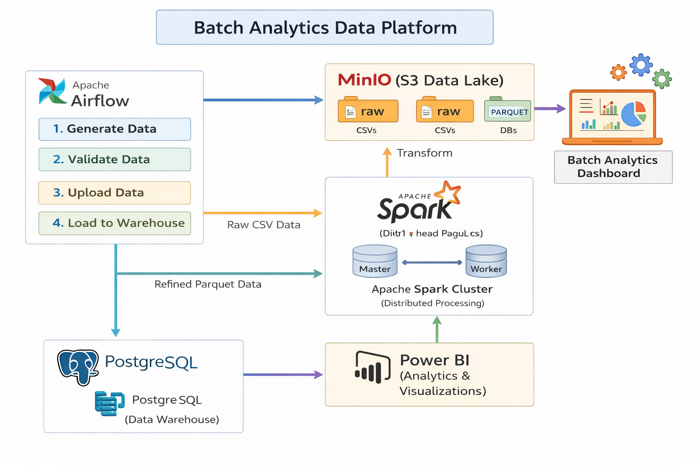
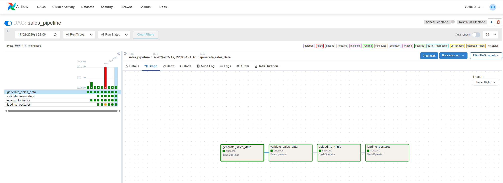
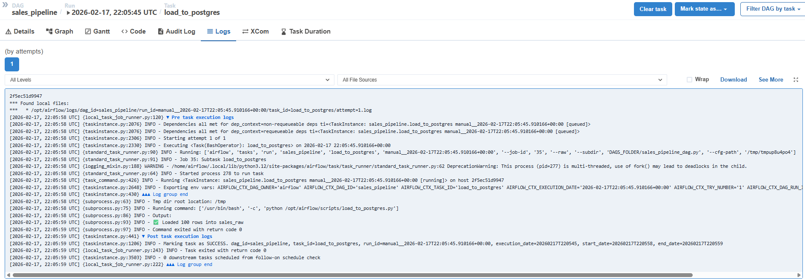
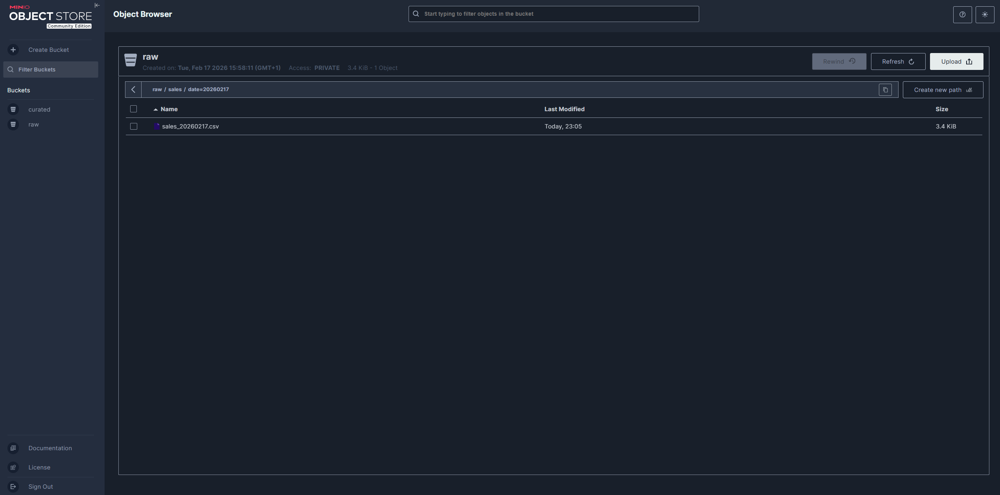
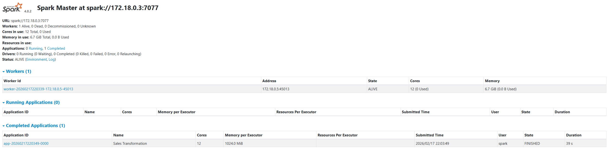
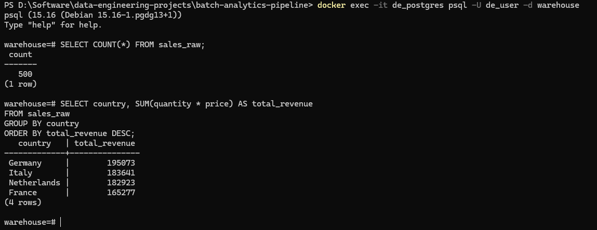
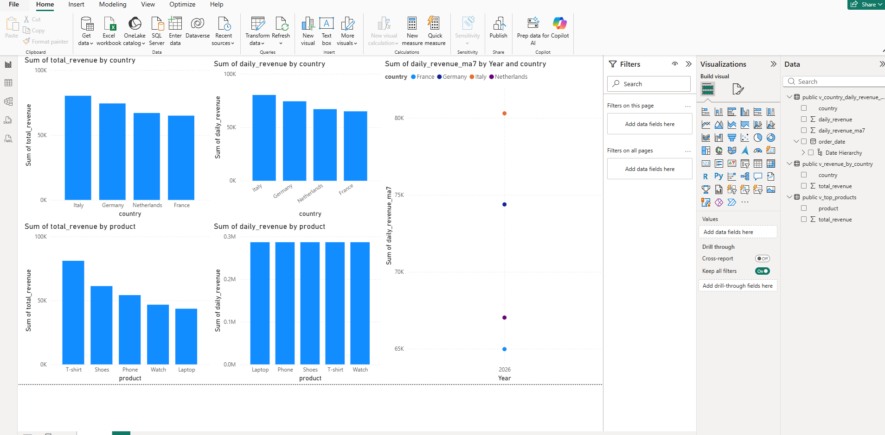
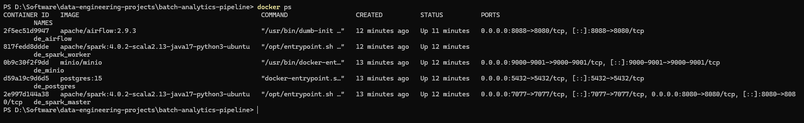

# 🚀 Batch Analytics Data Platform

### End-to-End Data Engineering Pipeline with Airflow, Spark, MinIO & PostgreSQL

------------------------------------------------------------------------

## 📌 Overview

This project demonstrates a **production-style batch analytics data
platform** built using modern data engineering tools.

It simulates a real-world sales pipeline that:

-   Generates raw data
-   Orchestrates workflows
-   Processes data using distributed computing
-   Stores results in a warehouse
-   Delivers business insights via BI dashboards

The entire system is fully containerized using Docker and orchestrated
via Apache Airflow.

------------------------------------------------------------------------

# 🏗 Architecture

## High-Level Architecture Diagram



------------------------------------------------------------------------

# 🔄 End-to-End Data Flow

Data Flow:

Python Data Generator\
↓\
Apache Airflow (Orchestration)\
↓\
MinIO (Raw Data Lake Layer - S3 Compatible)\
↓\
Apache Spark (Distributed Transformation Engine)\
↓\
PostgreSQL (Analytics Warehouse)\
↓\
Power BI (Business Intelligence Dashboard)

------------------------------------------------------------------------

# 📸 Project Screenshots

## 1️⃣ Airflow DAG Orchestration



## 2️⃣ Airflow Execution Logs



## 3️⃣ MinIO Raw Data Layer



## 4️⃣ Spark Cluster Execution



## 5️⃣ PostgreSQL Data Warehouse



## 6️⃣ Power BI Analytics Dashboard



## 7️⃣ Containerized Infrastructure (Docker)



------------------------------------------------------------------------

# 🔄 Pipeline Workflow

## 1️⃣ Data Generation

-   Synthetic sales data generated using Python
-   Includes product, country, quantity, price, and order date
-   Output: CSV files

## 2️⃣ Data Validation

-   Schema checks\
-   Null handling\
-   Data integrity verification

## 3️⃣ Raw Data Lake (MinIO)

-   CSV files uploaded into MinIO bucket\
-   Organized by date partitions\
-   S3-compatible object storage

## 4️⃣ Distributed Processing (Apache Spark)

-   Reads raw CSV\
-   Computes revenue (`quantity × price`)\
-   Writes transformed data as Parquet\
-   Runs on Spark Standalone Cluster (Master + Worker)

## 5️⃣ Data Warehouse (PostgreSQL)

-   Loads processed data into `sales_raw`
-   Aggregations for analytics
-   Optimized for BI queries

## 6️⃣ Visualization (Power BI)

-   Connects directly to PostgreSQL\
-   Country-level revenue\
-   Product-level breakdown\
-   Time-based moving averages

------------------------------------------------------------------------

# 🛠 Tech Stack

  Layer                    Technology
  ------------------------ --------------------------
  Orchestration            Apache Airflow
  Distributed Processing   Apache Spark
  Object Storage           MinIO (S3 Compatible)
  Data Warehouse           PostgreSQL
  Containerization         Docker & Docker Compose
  Visualization            Power BI
  Programming              Python (Pandas, PySpark)

------------------------------------------------------------------------

# 🐳 Containerized Deployment

All services run inside Docker containers:

-   Airflow (Scheduler + Webserver)
-   Spark Master
-   Spark Worker
-   PostgreSQL
-   MinIO

### Run the platform:

``` bash
docker compose up -d
```

------------------------------------------------------------------------

# 📊 Example Analytics Query

``` sql
SELECT country,
       SUM(quantity * price) AS total_revenue
FROM sales_raw
GROUP BY country
ORDER BY total_revenue DESC;
```

------------------------------------------------------------------------

# 🧠 Engineering Concepts Demonstrated

✔ Batch Processing Architecture\
✔ DAG-based Workflow Orchestration\
✔ Distributed Spark Computing\
✔ Data Lake → Warehouse Design\
✔ Containerized Infrastructure\
✔ SQL Analytics & Aggregations\
✔ End-to-End Data Lifecycle

------------------------------------------------------------------------

# 🎯 Why This Project Is Strong

This mirrors real-world enterprise data platforms:

-   Modular microservices
-   Clear data layering
-   Scalable transformation engine
-   Orchestrated workflow execution
-   Business-ready analytics output

------------------------------------------------------------------------

# 🚀 Future Improvements

-   Partitioned Parquet optimization
-   Slowly Changing Dimensions (SCD Type 2)
-   CI/CD Integration
-   Cloud deployment (AWS / GCP)
-   Monitoring with Prometheus & Grafana
-   Data Quality validation framework

------------------------------------------------------------------------

# 👨‍💻 Author

Mukesh Thenraj\
M.Sc. Automation & AI\
Data Engineering & Machine Learning\
Germany

------------------------------------------------------------------------

# ⭐ If You Found This Useful

Feel free to star the repository and connect with me on LinkedIn!


